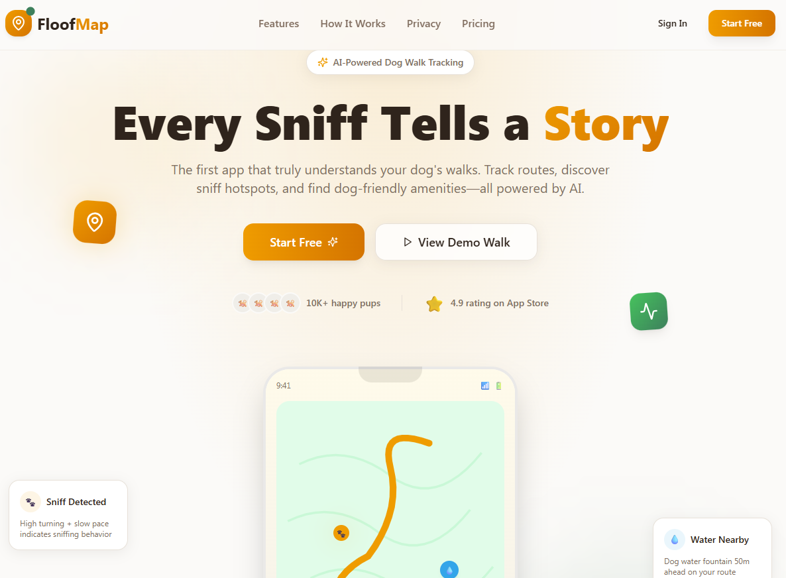
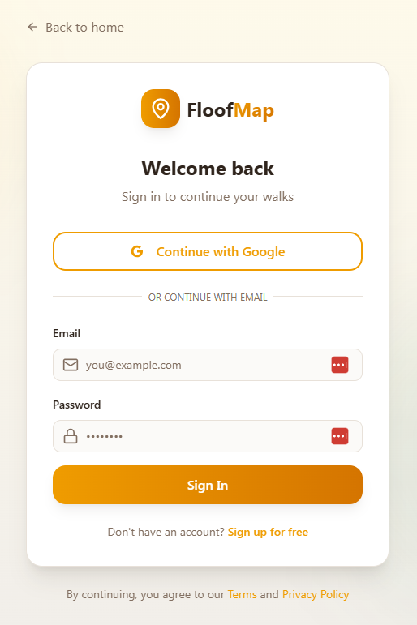
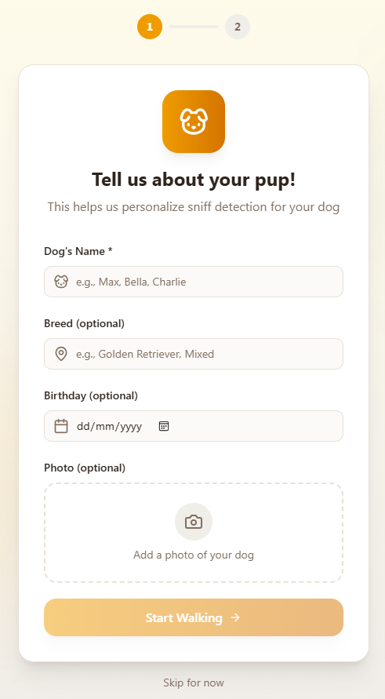
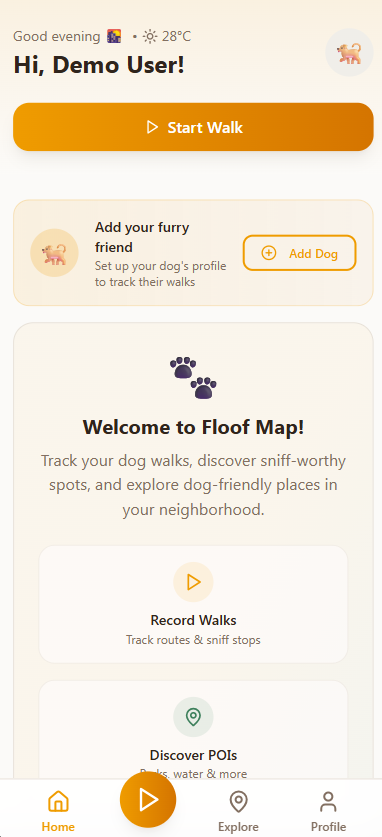
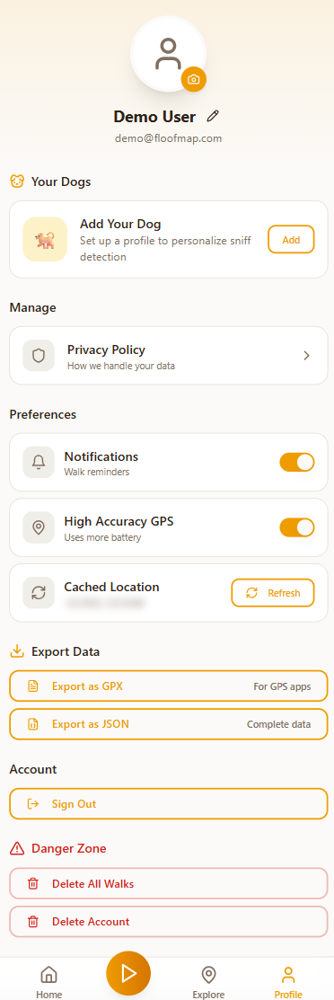
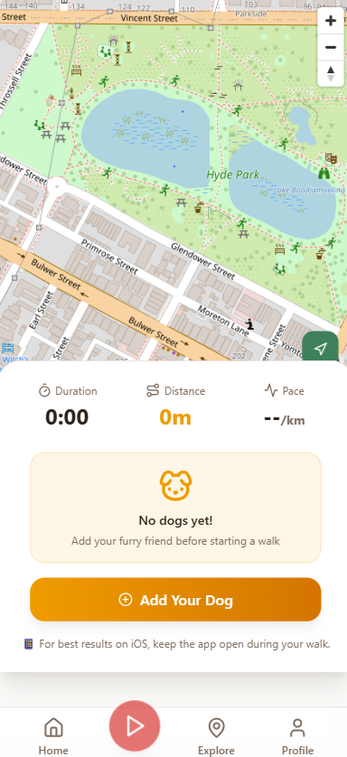

# Floofmap

**Built for LovHack 2026**

[Floofmap](https://floofmap.com) was created during the [LovHack 2026](https://lovhack.dev/) online hackathon—a 48-hour event focused on building real web apps fast. As an official participant, this project was designed, built, and shipped in under two days as part of the [LovHack](https://lovhack.dev/) challenge.

[Floofmap](https://floofmap.com) is a modern dog walking tracking application with both web and mobile support, built with React (web) and React Native with Expo (mobile), TypeScript, and [Supabase](https://supabase.com/).

## Project Structure

This repository contains two applications:

- **web/** - React web application built with Vite
- **mobile/** - React Native mobile application built with Expo

The mobile app includes **background GPS tracking** that works even when the app is not in the foreground or the screen is locked.

## Project info

**Live Demo:** https://floofmap.com

<!-- **Lovable Project:** https://lovable.dev/projects/floofmap -->

<!-- ## How can I edit this code?

There are several ways of editing your application. -->

<!-- **Use Lovable**

Visit the [Floofmap Project on Lovable](https://lovable.dev/projects/floofmap) to prompt changes and deploy instantly. Changes made via Lovable are committed automatically to this repo. -->

**Use your preferred IDE**

If you want to work locally using your own IDE, clone this repo and push changes.

**Requirements:**

- Node.js & npm ([install with nvm](https://github.com/nvm-sh/nvm#installing-and-updating))

## Getting Started

### Web Application

Follow these steps to run the web application:

```sh
# Step 1: Clone the repository
git clone https://github.com/paulbryan/floofmap

# Step 2: Navigate to the web directory
cd floofmap/web

# Step 3: Install dependencies
npm install

# Step 4: Start the development server
npm run dev
```

### Mobile Application (React Native with Expo)

The mobile app supports **background GPS tracking** for recording walks even when the app is not in the foreground.

Follow these steps to run the mobile application:

```sh
# Step 1: Navigate to the mobile directory
cd floofmap/mobile

# Step 2: Install dependencies
npm install

# Step 3: Start the Expo development server
npm start

# Then scan the QR code with the Expo Go app on your device
# Or press 'a' for Android emulator or 'i' for iOS simulator
```

**Important:** To test background location tracking, you need to:
1. Build a development build (not Expo Go): `npx expo run:android` or `npx expo run:ios`
2. Grant location permissions when prompted
3. Allow "Always" location access for background tracking

**Edit a file directly in GitHub**

- Navigate to the desired file(s) in the repo.
- Click the "Edit" button (pencil icon) at the top right of the file view.
- Make your changes and commit.

**Use GitHub Codespaces**

- Navigate to the main page of your repository.
- Click on the "Code" button (green button) near the top right.
- Select the "Codespaces" tab.
- Click on "New codespace" to launch a new Codespace environment.
- Edit files directly within the Codespace and commit and push your changes once you're done.

## Supabase Database Setup

This app uses a [Supabase](https://supabase.com/) database for backend, authentication, storage, and edge functions.

### 1. Create a Supabase Project

1. Go to [Supabase](https://app.supabase.com/) and sign in or create an account.
2. Click **New project** and fill in the details (name, password, region).
3. Wait for your project to be provisioned.

### 2. Set Required Supabase Secrets

You will need to add the following secrets to your Supabase project:

1. In your Supabase project dashboard, go to **Project Settings > API**.
2. Copy your **Project URL** and **anon/public API key**.
3. Create environment files:

   **For web application** - Create `web/.env`:
   ```env
   VITE_SUPABASE_URL=your-project-url
   VITE_SUPABASE_ANON_KEY=your-anon-key
   ```

   **For mobile application** - Create `mobile/.env`:
   ```env
   EXPO_PUBLIC_SUPABASE_URL=your-project-url
   EXPO_PUBLIC_SUPABASE_ANON_KEY=your-anon-key
   ```

### 3. Run Database Migrations

1. Install the [Supabase CLI](https://supabase.com/docs/guides/cli) if you haven't already:
   ```sh
   npm install -g supabase
   ```
2. Authenticate the CLI:
   ```sh
   supabase login
   ```
3. Link the CLI to your project:
   ```sh
   supabase link --project-ref <your-project-ref>
   ```
   (You can find your project ref in the project dashboard URL or settings.)
4. Run the migrations:
   ```sh
   supabase db push
   ```

This will apply all SQL migration scripts in the `supabase/migrations/` directory to your Supabase database.

---

## Technology Stack

### Web Application
- [Vite](https://vitejs.dev/)
- [React](https://react.dev/)
- [TypeScript](https://www.typescriptlang.org/)
- [Tailwind CSS](https://tailwindcss.com/)
- [shadcn/ui](https://ui.shadcn.com/)
- [Supabase](https://supabase.com/) (backend, auth, storage, edge functions)

### Mobile Application
- [Expo](https://expo.dev/)
- [React Native](https://reactnative.dev/)
- [React Navigation](https://reactnavigation.org/)
- [expo-location](https://docs.expo.dev/versions/latest/sdk/location/) (background GPS tracking)
- [react-native-maps](https://github.com/react-native-maps/react-native-maps)
- [Supabase](https://supabase.com/) (backend, auth, storage)

## Deployment

### Web
Deploy via [Lovable](https://lovable.dev/projects/floofmap): open the project and click Share → Publish.

### Mobile
Build and submit to app stores:
```sh
cd mobile
npx eas build --platform android
npx eas build --platform ios
npx eas submit
```

## Background Location Tracking (Mobile)

## Background Location Tracking (Mobile)

The mobile app includes **background GPS tracking** using Expo's location services. This allows the app to track your dog walks even when:
- The app is in the background
- The screen is locked
- You switch to another app

### How it works:

1. When you start recording a walk, the app requests background location permissions
2. A foreground service notification appears (on Android) indicating the walk is being tracked
3. The app continues to record GPS coordinates at regular intervals
4. All location data is stored and synced to Supabase when the walk is stopped

### Permissions Required:

**iOS:**
- Location When In Use
- Location Always (for background tracking)

**Android:**
- ACCESS_FINE_LOCATION
- ACCESS_BACKGROUND_LOCATION
- FOREGROUND_SERVICE

These permissions are automatically configured in the app.json file.

## Custom Domains

To connect a custom domain, go to Project → Settings → Domains in Lovable and click Connect Domain.

Read more: [Setting up a custom domain](https://docs.lovable.dev/features/custom-domain#custom-domain)

---

## Code Structure

The codebase is organized as follows:

- **src/** — Main frontend source code

  - **components/** — Shared React components
    - **app/** — App layout, navigation, and authenticated app shell
    - **landing/** — Landing page and marketing components
    - **map/** — Map and geolocation UI components
    - **ui/** — Reusable UI primitives (buttons, modals, etc.)
  - **hooks/** — Custom React hooks (e.g., for mobile detection, toast notifications, Supabase integration)
  - **integrations/supabase/** — Supabase client and helpers
  - **lib/** — Utility functions and offline sync logic
  - **pages/** — Top-level route components (e.g., Auth, Onboarding, Pricing, Terms, etc.)

- **public/** — Static assets (icons, manifest, etc.)
- **supabase/** — Supabase backend config, SQL migrations, and edge functions
  - **functions/** — Supabase Edge Functions (serverless backend logic)
  - **migrations/** — SQL migration scripts for the database

### Major Components

- **AppLayout** — Main authenticated app shell and navigation
- **Map** — Interactive map, route drawing, and POI display
- **NavLink** — Navigation link abstraction
- **Onboarding** — User onboarding flow
- **Auth** — Authentication and login/signup
- **Demo** — Demo mode for exploring the app without an account

See the folders above for more details on each area.

## Screenshots

Below are screenshots of the app, in order of the user journey:

### Homepage



### Sign In



### Onboarding



### Dashboard



### Profile



### Start Walk


